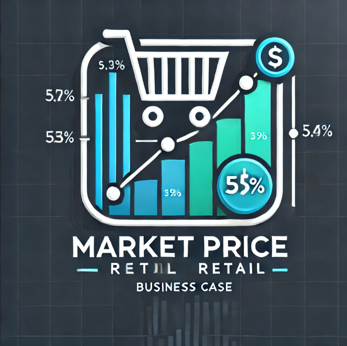
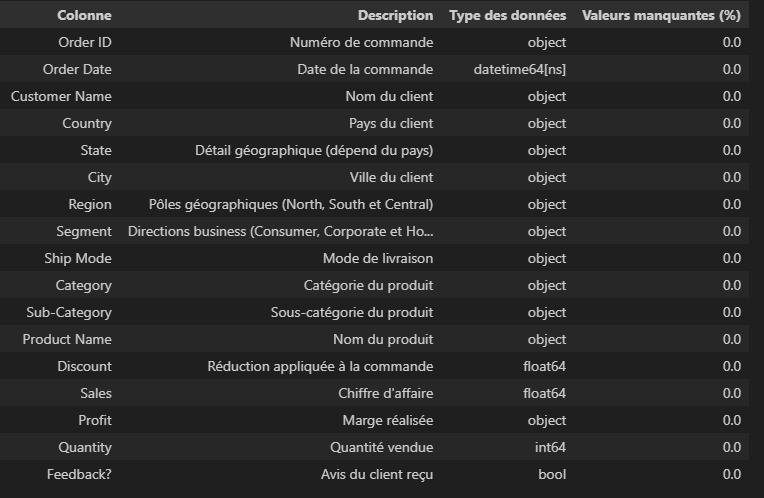

# **Business-case-Market-Price-Retail** 

  

## **Business case overall goals** 

* Perform data-driven analysis 
* Present relevant visualizations  
* Propose advice to help make decisions  

## **Context**  
You are a data analyst for a great retail company. Sales service has a lot of data about costs and benefits around the world.
They need to explore and focus on a specific and juicy market (because they have a rise in benefits). They also feedback about customers you need to process. Your aim is to explore, present and target a market. 

## **Business problem** 
What can the company do to **`reduce costs and increase benefits`**?

## **Database content** 
The dataset is composed of 8047 customers, with city and region. Also, for each, you have the segment matching (Home Office, Consumer, Corporate), the category, and sub-category (Paper, Art, copiers, etc.). For each product, you have the name, the discount, the sales, the profit, and the quantity. 

  

**`Data collection`** and **`exploration`** made on pandas. You can view raw codes [here](https://github.com/Diaure/Business-case-Market-Price-Retail/blob/main/analysis.ipynb). Overall, no major modifications on data. 

## **Data analysis** 

Business case results presentation  

Dashboard: pdf format, pbix format  
